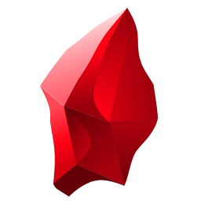

<p align="center">
  
</p>

# Obsidian Taskbar Icons

[](https://github.com/slappycat2/obsidian-taskbar-icons/releases/latest)
[](https://github.com/slappycat2/obsidian-taskbar-icons/releases)
[](https://github.com/slappycat2/obsidian-taskbar-icons/actions/workflows/build.yml)
[](LICENSE)
[](https://github.com/slappycat2/obsidian-taskbar-icons/commits/main)
[](https://github.com/slappycat2/obsidian-taskbar-icons/issues)
[](https://github.com/slappycat2/obsidian-taskbar-icons)
[](https://github.com/slappycat2/obsidian-taskbar-icons/stargazers)

[](https://www.microsoft.com/windows/windows-11)
[](https://dotnet.microsoft.com/download)
[](src/ObsidianTaskbarIcons)
[](https://jrsoftware.org/isinfo.php)
[](https://obsidian.md)
[](https://ko-fi.com/swenlarsen)

---

### Do you use Windows? Do you have multiple, open vaults at once? Tired of not being able to tell which is which? Want to buy a car?

If you answered, "YES!" to the first three, I think I can help. I wrote a tool that will manage separate taskbar icons with separate names for each of your vaults. Features include:

## :fire: Features
- Each [Obsidian](https://obsidian.md) vault can have its own taskbar button.
- Each button can have a unique name and icon. Use the included icons or roll your own.
- Doesn't touch Obsidian, and no plugins involved, so no danger or impact there.
- Click the Vault's taskbar button and that vault opens. Clean and simple.
- Taskbar Icon windows stay grouped together for that vault alone. No co-ed funny business!
- Create as many as you need, pin or unpin just like any other taskbar icon.
- Changing the icon in the properties panel works, too. Just like a big computer!
- Alt-Tab, Task View and the taskbar thumbnails show the vault icon instead of Obsidian's.
- Easy setup, and easy uninstall.
- Free! So, download it as many times as you like! Makes a great stocking stuffer!

---
> If this little script helps you in any way, please help a poor, vibe coder out:\
>\
> ***Please support my token addiction!*** Give me a :star: (see above)\
> And/or [buy me a :beer: coffee!](https://ko-fi.com/swenlarsen). :grin: It's greatly appreciated!\
>\
> No? **Don't worry about it.** ***Enjoy!*** (Who's got a light?)

---

*Tl;Dr* - Skip the boring, AI generated stuff and :rocket: ***[take me to the install!](#installation)***

---

## The problem
Windows groups taskbar buttons by an identifier called the *AppUserModelID*. Obsidian gives the
same identifier (`md.obsidian`) to every window it opens. As a result, every vault lands under the
same button, and a pinned shortcut can only open "Obsidian", never a specific vault.

The obvious workarounds do not help:

- Renaming a copy of `Obsidian.exe` changes nothing. The identifier comes from the application,
  not from the file name.
- A shortcut to an `obsidian://` link opens the correct vault, but the window still groups under
  the generic button, and the shortcut cannot reliably keep a custom icon.

### How the tool solves it

1. It writes a Start menu shortcut for each vault. The shortcut carries a unique identifier
   (`Obsidian.Vault.<name>`) and the icon you selected. When you pin that shortcut, the taskbar
   button owns that identifier.
2. The shortcut runs the tool in launcher mode. The launcher opens the vault through the
   `obsidian://open?vault=` link, waits for the vault window to appear, and then writes the same
   identifier, display name and icon into the window property store
   (`SHGetPropertyStoreForWindow`). An identifier set on a window takes priority over the one set
   by the application.
3. The window and the pinned button now carry the same identifier, so Windows groups them together.
4. A small resident **watcher** (`ObsidianTaskbarIcons.exe watch`) also sets the icon as the window
   icon (`WM_SETICON`). That is what makes Alt-Tab, Task View and the taskbar thumbnails show the
   vault icon instead of Obsidian's. Windows discards a process's icons when that process exits, so
   the watcher has to stay running. The launcher starts it. Once a second it checks every open
   Obsidian window, including windows Obsidian opened on its own and pop-out windows. It exits five
   minutes after the last Obsidian window closes, and it shows a red gem in the system tray while
   it runs (see [The tray icon](#the-tray-icon)).

Everything happens from outside Obsidian. Nothing is patched or injected. You can leave Obsidian's
*Custom app icon* setting as it is; the watcher's icon simply sits on top of it.

---
<a id="installation"></a>
## :rocket:Installation

### With the installer (recommended)

Download `ObsidianTaskbarIcons-Setup-<version>.exe` from the
[Releases](https://github.com/slappycat2/obsidian-taskbar-icons/releases) page and run it. It needs
the [.NET 10 Desktop Runtime](https://dotnet.microsoft.com/download); if that is missing, Windows
offers to fetch it the first time the program starts.

The installer:

- Shows the MIT license and asks you to accept it.
- Asks whether to add **Obsidian Taskbar Icons** to the Start menu (checked by default).
- Installs to `%LOCALAPPDATA%\ObsidianTaskbarIcons` for the current user only, so there is no
  admin prompt.
- Registers an uninstaller in **Settings > Apps > Installed apps** (also known as Programs &
  Features).
- Offers to run the program right away on the last page.

Running a newer installer over an existing install upgrades it in place. Your vault profiles,
generated icons and pinned buttons are kept, and any open vault windows are re-tagged afterwards.

### From source

You need the [.NET 10 SDK](https://dotnet.microsoft.com/download).

```powershell
git clone https://github.com/slappycat2/obsidian-taskbar-icons.git
cd obsidian-taskbar-icons
.\install.ps1
```

The `install.ps1` script builds a single-file executable, copies it and the sample icons to the
same folder the installer uses, and adds the Start menu entry. Shortcuts created by the tool always
point at that installed copy, so rebuilding later never breaks an existing pin.

---
## :notebook: Usage

1. Open **Obsidian Taskbar Icons** from the Start menu. The window shows the tool's own red gem at
   the top with its version number.
2. Select a vault. The list comes from Obsidian's own vault registry. To use any other folder,
   click **Browse**.
3. Change the taskbar name if you want to.
4. Select an icon if you want to. Accepted file types are `.ico`, `.png`, `.jpg`, `.bmp`, `.exe`
   and `.dll`. Images are converted automatically into a multi-size icon (16 to 256 pixels). If you
   do not select an icon, the tool uses Obsidian's icon. **Browse** opens in the
   [sample icons](samples/icons) folder, which contains eight Obsidian-style gems in different
   colors: blue, cyan, green, magenta, purple, red, sky and yellow.
5. Click **Create shortcut & launch**. The vault opens and appears as its own taskbar button.
6. Right-click that taskbar button and choose **Pin to taskbar**. That is the last step.

The shortcut also appears in the Start menu as "Obsidian - *name*", so you can pin it from there
as well.

The lower half of the window lists the icons you have created. Each entry has four buttons:
**Launch**, **Open shortcut folder**, **Re-tag open windows** and **Remove**.

## The tray icon

While the watcher runs, a red gem sits in the system tray (the notification area next to the
clock). Hovering it shows how many vault windows it is keeping tagged. Double-click it to open the
main window, or right-click it for the menu:

- **Open Obsidian Taskbar Icons** opens the main window.
- **Re-tag open windows now** re-applies the identity and icon to every open vault window that
  has a profile. Use it if a window has lost its icon.
- **Start with Windows** starts the watcher at login, so vaults that Obsidian opens on its own
  (for example at login, or through Obsidian's vault switcher) get their icons without you
  launching them from a pinned button first. This writes one value under the current user's
  `Run` registry key; untick it to remove that value. A watcher started this way stays running
  even when no Obsidian window is open.
- **Exit watcher** stops it. Window icons fall back to Obsidian's own until the next launch or
  re-tag.

The tray icon disappears when the watcher exits, which it does on its own five minutes after the
last Obsidian window closes (unless it was started with **Start with Windows**).

## Command line

The same executable is also a command line tool. This is what the shortcuts call.

```text
ObsidianTaskbarIcons.exe                                          open the window
ObsidianTaskbarIcons.exe create --vault <folder> [--name <text>] [--icon <file>] [--no-launch]
ObsidianTaskbarIcons.exe launch --id <slug>                       open one vault and tag its window
ObsidianTaskbarIcons.exe tag                                      re-tag every open vault window that has a profile
ObsidianTaskbarIcons.exe watch [--persistent]                     stay resident (with a tray icon) and keep window icons and identifiers in sync
ObsidianTaskbarIcons.exe inspect                                  list Obsidian windows with their current identifiers
```

`<slug>` is the vault folder name. Any character outside `A-Z a-z 0-9 . _ -` is replaced with `_`.
`--persistent` makes the watcher ignore the five-minute idle exit; the **Start with Windows**
entry uses it.

## Good to know

- **Vaults that Obsidian opens by itself.** This includes vaults restored at login and vaults
  opened through Obsidian's own vault switcher. The watcher tags them as long as it is running.
  Tick **Start with Windows** in the tray menu to make sure it always is. Otherwise, click
  **Re-tag open windows** or launch any vault from its pinned button. Both start the watcher.
- **The window icon lives only while the watcher runs.** If you stop the watcher, Alt-Tab falls
  back to Obsidian's icon until the next launch or re-tag. The `inspect` command reports whether
  the watcher is running, and so does the tray icon.
- **Pinning is manual.** Windows 11 does not allow a program to pin anything to the taskbar, so
  the final step is one right-click. Unpinning is manual too. **Remove** deletes only the shortcut,
  the icon and the profile.
- **The vault must be known to Obsidian.** The `obsidian://` link only opens vaults that appear in
  Obsidian's vault switcher. Open a new vault once from inside Obsidian first.
- **Pop-out windows** ("Open in new window") are picked up by the watcher within a second.
- **Tested versions.** Obsidian 1.14 on Windows 11 build 26200. The launcher matches on Obsidian's
  window title, which looks like `Note - Vault - Obsidian 1.14.1`. If a future Obsidian changes
  that format, the `inspect` command shows what the titles look like now.

## Where things live

| Item | Location |
| --- | --- |
| Installed executable | `%LOCALAPPDATA%\ObsidianTaskbarIcons\bin\` |
| Uninstaller | `%LOCALAPPDATA%\ObsidianTaskbarIcons\unins000.exe` (installer setups only) |
| Profiles | `%LOCALAPPDATA%\ObsidianTaskbarIcons\profiles.json` |
| Generated icons | `%LOCALAPPDATA%\ObsidianTaskbarIcons\icons\` |
| Sample icons | `%LOCALAPPDATA%\ObsidianTaskbarIcons\samples\` (copied from `samples\icons`) |
| Per-vault shortcuts | `%APPDATA%\Microsoft\Windows\Start Menu\Programs\Obsidian - *.lnk` |
| Start menu entry | `%APPDATA%\Microsoft\Windows\Start Menu\Programs\Obsidian Taskbar Icons.lnk` |
| Start with Windows | `HKCU\Software\Microsoft\Windows\CurrentVersion\Run\ObsidianTaskbarIconsWatcher` |

## Uninstall

If you used the installer, open **Settings > Apps > Installed apps** (or Programs & Features in
the Control Panel), find **Obsidian Taskbar Icons** and choose Uninstall. The uninstaller stops the
watcher, removes the executable, the sample icons, the Start menu entries, the per-vault shortcuts
and the Start with Windows value, and then asks whether to delete your profiles and generated
icons as well. Pinned taskbar buttons cannot be removed by a program, so unpin those yourself.

If you installed from source:

1. Unpin the buttons from the taskbar.
2. End any running `ObsidianTaskbarIcons.exe` process in Task Manager (or choose **Exit watcher**
   from the tray icon).
3. Delete the `Obsidian - *.lnk` shortcuts and the "Obsidian Taskbar Icons" shortcut from the
   Start menu folder listed above.
4. If you ticked **Start with Windows**, untick it first, or delete the registry value listed above.
5. Delete the `%LOCALAPPDATA%\ObsidianTaskbarIcons` folder.

## Building

```powershell
dotnet build src\ObsidianTaskbarIcons\ObsidianTaskbarIcons.csproj -c Release
```

The project is a single C# WinForms application targeting `net10.0-windows`, with no NuGet
dependencies. The red gem from `samples\icons\gemRed.ico` is both the executable's icon and an
embedded resource, which is where the window header and the tray icon get it from. The interesting
parts are in `src\ObsidianTaskbarIcons\Interop\`:

- `ShellLink.cs` writes shortcuts that carry an AppUserModelID.
- `WindowIdentity.cs` finds Obsidian windows and stamps the identity onto them.
- `WindowIcon.cs` pushes an icon onto a window that belongs to another process.

`Watcher.cs` is the resident loop that keeps both the identity and the icon applied, and owns the
tray icon.

### Building the installer

The installer is an [Inno Setup](https://jrsoftware.org/isinfo.php) script in
`installer\ObsidianTaskbarIcons.iss`. With Inno Setup 6 installed
(`winget install JRSoftware.InnoSetup`):

```powershell
.\installer\build-installer.ps1
```

This publishes the executable, reads the version from the project file, and writes
`dist\ObsidianTaskbarIcons-Setup-<version>.exe`.

## License

MIT. See [LICENSE](LICENSE).
